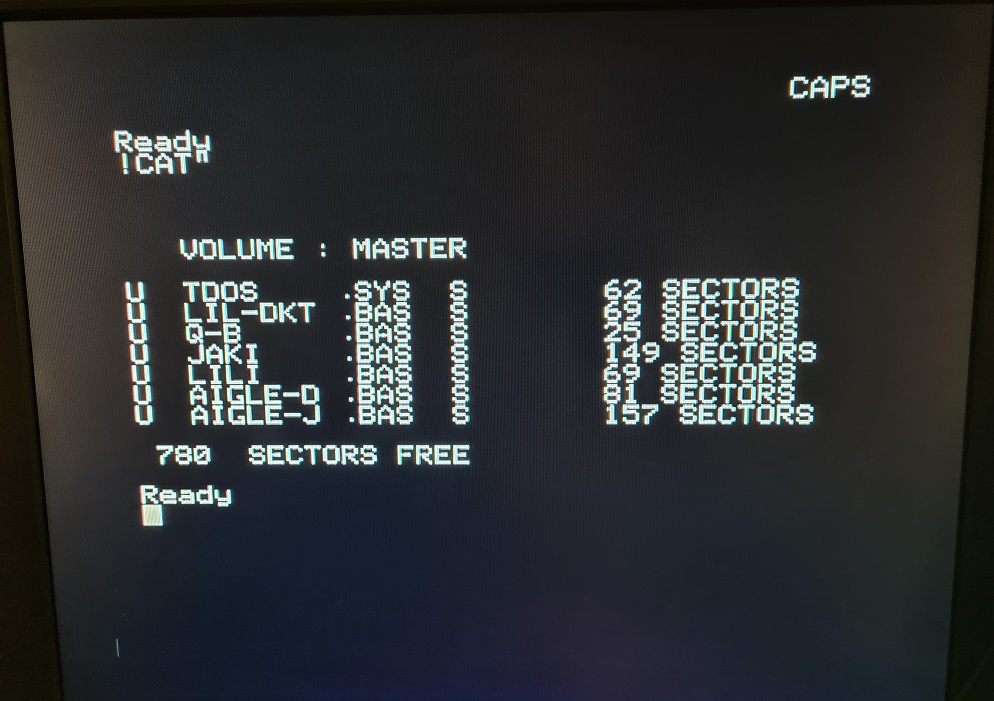

# Ftdos

## Introduction

ftdos command starts ftdos .dsk file without jasmin floppy disc controler. It's a beta version.

## Usage

To start a .dsk file

/#ftdos mydsk

To display the ftdos command version :

/#ftdos -v

ftdos disks must be present in /home/basic11/dsk/

## Informations

* Write on .dsk file is not supported
* refers to ftdos manual for usages
* you need to switch off/on the oric when you reset into ftdos mode, because there is a bug when we reset during ftdos mode. Ftdos does not load and reboot into Orix

