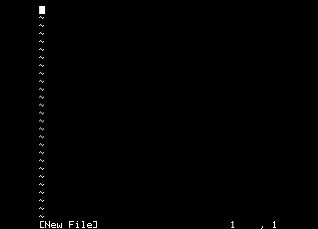

# vi

## Beta version

USE AT YOUR OWN RISK

## Commands

*:q* write and quit
*:w* write
*:w myfile* write into file

## Limits

* max length line : 79 chars
* Max length of the file : 2000 chars
* does not manage "tab"

## Install

Can be loaded into a rom bank.

```bash
/#cd /usr/share/vi
/usr/share/vi#orixcfg -r -s 1 vi.rom
```


