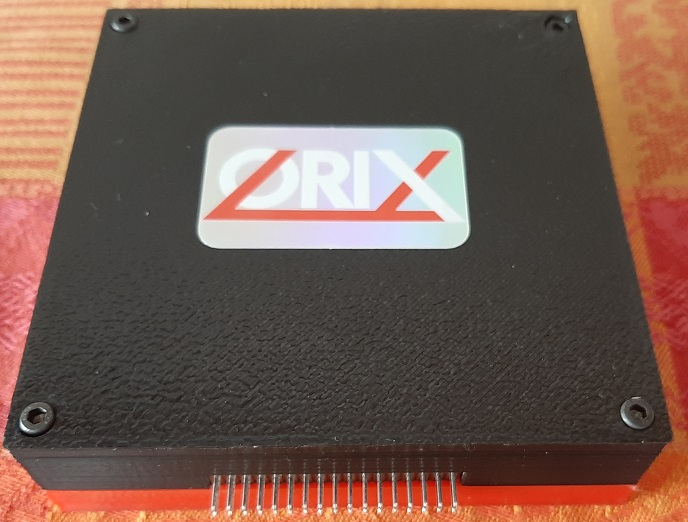

# Twilighte board

The Twilighte board is an extra hardware connected on the the oric (Atmos or Oric-1), it improves Oric with hardware feature as eeprom (in system update), RAM, joysticks, usb controler.

It handles 32 eeprom banks of 16KB and 32 Banks of 16KB for RAM. The architecture of hardware registers, joystick management has compatibility with Telestrat in order to have Oric working on Telestrat or Atmos.

| Feature     | Availability                          |
| ----------- | ------------------------------------ |
| `Sdcard`         | :material-check:     |
| `Usbdrive storage`       | :material-check:  |
| `Long filename`    | :material-check:      |
| `Every usb device control`    | :material-check:     |
| `2 Joysticks`    | :material-check:     |
| `512KB RAM memory`    | :material-check:     |
| `512KB eeprom memory`    | :material-check:     |
| `Eeprom in system update`    | :material-check:     |
