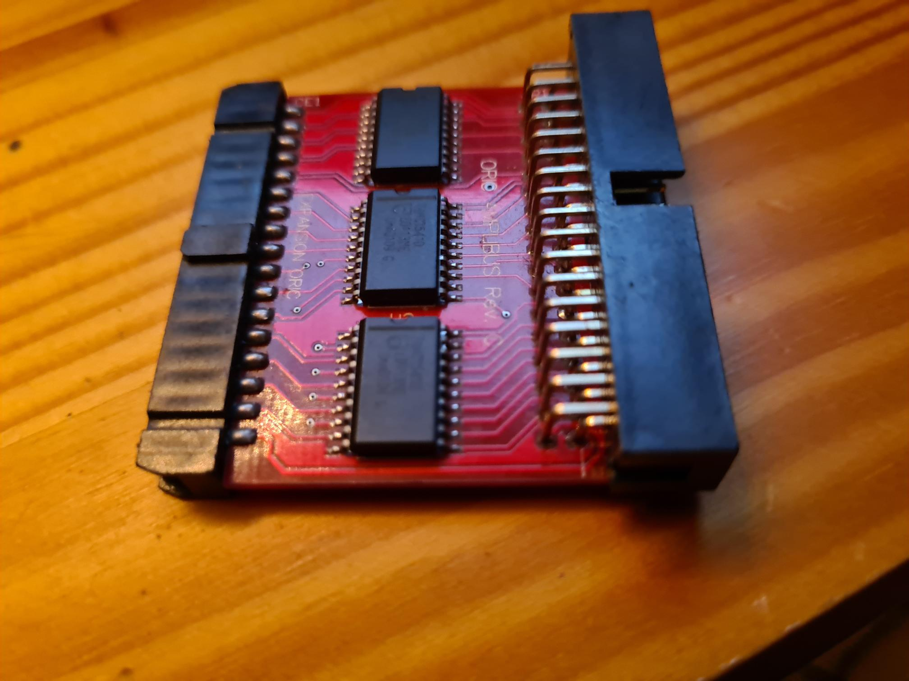

# How to connect a microdisc controler with the twilighte board

* Solder A14 et A15 on the microdisc controler to ground
* remove eeprom
* connect silicebit amplibus on twilighte board expansion port

## Issues

* Reset from expansion board does not work, the one on the microdisc controler is working
* *The usb controler in the twilighte board extension refuses to work properly during 20 minutes*, you need to wait 20 minutes before trying to use commands on twilighte configuration.

## Steps

### Step 1 : Check Drive

Check if the switches are ok on the drive :

### Step 3 : solder A14 and A15 to ground on microdisc to oric connector

### Step 4 : Remove eeprom

### Step 5 : Connect and switch on

* Connect microdisc controler to the orioc
* Connect the drive to microdisc controler
* Switch on the oric with its own psu
* Switch on the microdisc controleur with its own psu too

!!! warning "The internal usb controler in Twilighte board refuses to work correctly during 20 minutes, in this configuration. Wait a bit"

### Step 6 : Uses bootfd to start bootsector

/#bootfd

### Step 7 (Optionnal) : Use a pico psu for the microdisc controler

If you have a micro psu, you can plug it for your usb controler. You can also buy an connector to plug the micro psu if you want to insert it in a case.

The following photo shows the pico psu and the adaptor for pico psu.

* Solder "power on" on the adaptator, in order to have the pico starting

* plug a 12V PSU (1,5A used during test), in the jack connector of the pico psu
