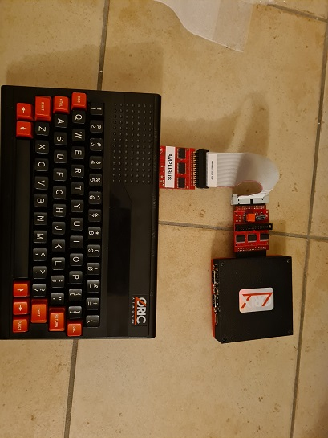

# Ribbon cable management on twilighte board

The twilighte board is built without ribbon cable but it can be done with amplibus and a ribbon cable. It works only if there is 2 lines of 74hct541 (see bellow).

This trick is also useful for Oric which does not want to start with the board. The board has some incompatibility issue with some oric, but it's can be connected with 2 lines of 74HCT541. One from an amplibus for example, and another from the twilighte board expansion board.

## First step build the ribbon cable

Get a floppy disk ribbon cable. And put a female HE10 34 like this at approximately 13 cms (It could be more, but greater cable is not tested yet)from the previous connector :

Put the notch (black connector) at the bottom and crimp the HE10 34 connector (Grey connector) like this :

On the picture the notch is not visible on the black connector, because it's on the other side. But the hole on the grey connector is visible. It's really important to keep theses positions.

Now we can use any amplibus or another expansion board from the twilighte board

## with a simple amplibus

If you have a amplibus as Silicebit one (see the picture), you can now connect the ribbon cable to these amplibus (Black connector on the previous picture) (notch must be at the bottom as the Silicebit amplibus permits).

And plug the grey connector to twilighte board expansion board. The grey connector must be with the hole at the top when connected to expansion board.

## You have an extra twilighte expansion board

if you have this one, you can not connect without a connector modification. The angle connector to the twilighte board side must be to the top of the board. The previous ribbon cable can be connected with the notch at the bottom of the card like the next picture

Full overview :

