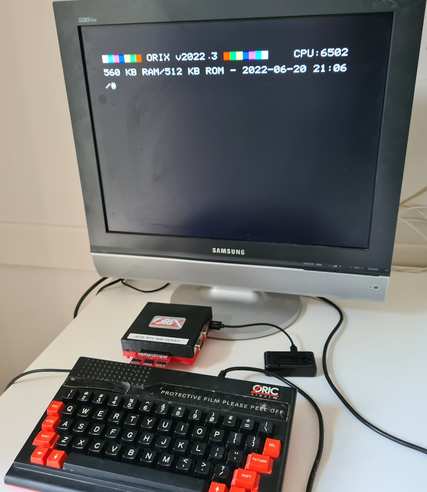

# Informations

!!! info "Kernel 2023.3 and Shell 2023.3 had been released (25-09-2023) : [Notes](update/2023_3.md)"

## Overview

Orix is an operating system which handles others programs in order to start all softwares available on the Oric.

There is 4 modes :

* Native mode binary in order to start binary from command line
* [basic1O](./commands/basic10.md) and [basic11](./commands/basic11.md) binaries which starts .tap file (Oric-1 for basic10, atmos for basic11)
* [ftdos](./commands/ftdos.md) command in order to start ftdos .dsk command
* sedoric command in order to start sedoric .dsk command (will be released soon)
