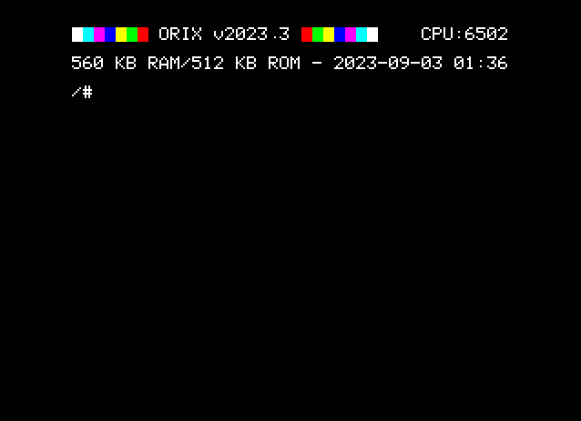

# Software

{: style="height:350px;"}

## Orix

{ align=left }

Orix is the default (D)OS of the board when it plugged into the oric. Orix is a linux/unix style OS. It's the main OS which can help to start every others systems as oric-1 ROM, atmos ROM etc

Orix must have at least 2 banks to boot : Kernel and shell.

Kernel is a bank inserted in the 7th slot and it's the first start to boot. Shell is the 5th bank and contains sh binary.

When system starts, kernel forks "sh" commands at the end of the kernel initialisation. Shell is available and can starts any commands.

There are 2 kind of rom :

* Standalone ROM : it does not need to call kernel primitive, and manage all the main memory (for example : atmos ROM)

* Orix Roms : in that case, rom does not manage the main memory, and calls kernel to do tasks (for example : Shell roms).

In Orix roms, the rom declares commands to an offset in the bank and can be accessed from command line. If any command are typed from prompt, kernel will launch "XEXEC" primitive to find in any rom where the command is.

| Feature     | Availability                          |
| ----------- | ------------------------------------ |
| `Multitasking`         | :material-close:     |
| `Long filename management`       | :material-close:  |
