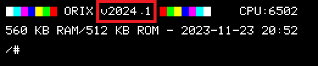
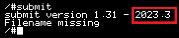
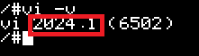

# Scripts

## Introduction

This tutorial needs at least :

* Kernel : 2024.1
* Shell : 2024.1
* vi: 2024.1
* submit: 2023.3

Checking versions

### Check Kernel and shell



If it's not "v2024_1", then download and install last version: [cardridge.tgz](http://repo.orix.oric.org/dists/official/tgz/6502/cardridge.tgz)

```bash
/#cd usr/share/carts
usr/share/carts#cd 2024.1
usr/share/carts/2024.1#orixcfg -k kernelus.r64
```

### Check Submit

```bash
/#submit
```



If it's not the right version, download [submit](http://repo.orix.oric.org/dists/official/tgz/6502/submit.tgz)

### Check vi

```bash
/#vi -v
```



If it's not the right version, download [vi](http://repo.orix.oric.org/dists/official/tgz/6502/vi.tgz), and install it :

```bash
/#cd usr/share/vi
usr/share/vi#orixcfg -r -s 0 vi.rom
```

## Executable script

### Launch basic11 with a personnal folder

```bash
vi /bin/myprg
```

Press "i" (vi program)

type (where /home/myfolder is created, and will be your personnal folder):

```bash
#!/bin/submit
basic11 -p /home/myfolde
exit
```

Press "ESC"

Type ":w"

Type ":q"

```bash
myprg
```

=> It will start basic11 -p /home/myfolder.

### Launch 3dfongus (or any .tap file)

```bash
vi /bin/3dfong
```

Press "i" (vi program)

```bash
#!/bin/submit
basic11 "3DFONGUS
exit
```

Press "ESC"

Type ":w"

Type ":q"

```bash
3dfong
```

=> It will start basic11 "3DFONGUS


<iframe width="500" height="308" src="https://www.youtube.com/embed/ZpCt3E5-sG4" title="Orix : vi and scripting" frameborder="0" allow="accelerometer; autoplay; clipboard-write; encrypted-media; gyroscope; picture-in-picture; web-share" allowfullscreen></iframe>

