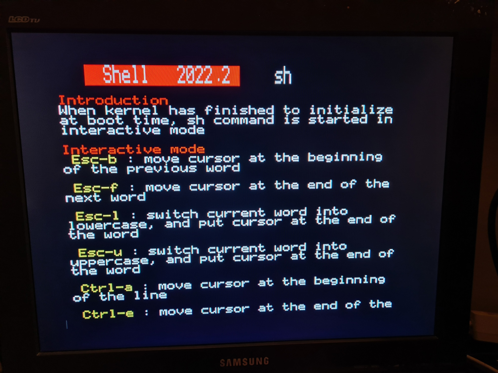
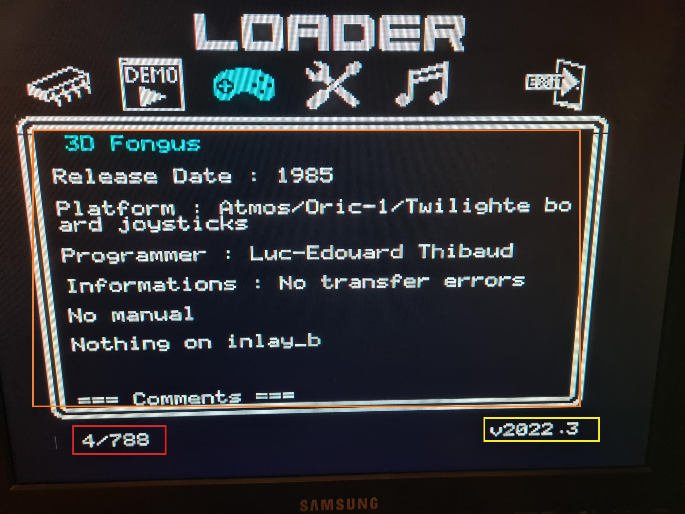
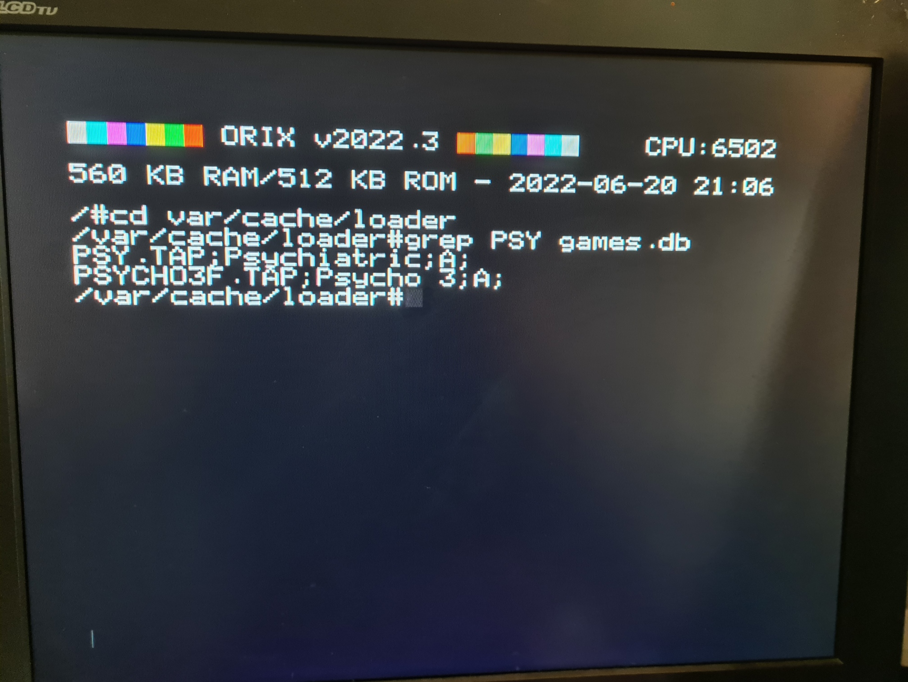
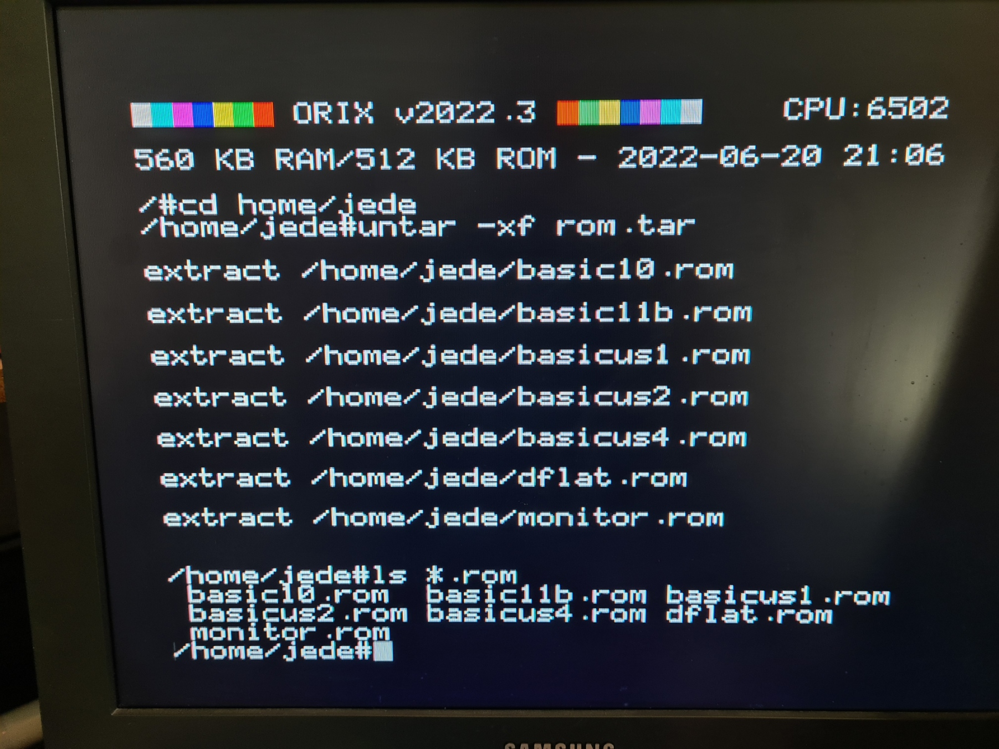
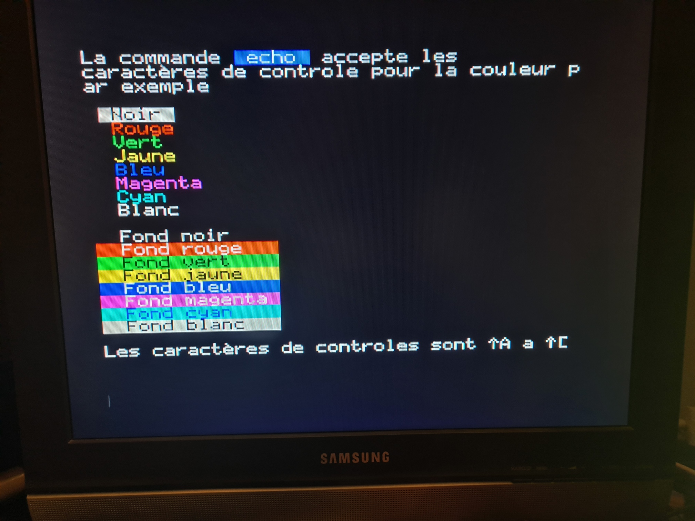

# v2022.3

## install

Download [Kernel](http://repo.orix.oric.org/dists/official/tgz/6502/cardridge.tgz)

## Kernel

* [XMKDIR] Fix registers

* [XATN] Arc Tan routine removed

* [XCOS] Cosinus routine removed

* [XSIN] sinus routine removed

* [XLN] Ln routine removed

* [XLOG] Log routine removed

* [XEXP] Exp routine removed

* [XOPEN] Now, WR_ONLY Flag does not create the file. O_CREAT is handled and create the file

* [XFSEEK] now works in 32 bits mode (return EOK if OK, EINVAL if whence is not recognize)

* [XOPEN] [XREAD] [XCLOSE] Allows to open 2 files at the same times

* [XFREE] Fix many bugs

* [Load from device] Add magic token to start any binary without checks

* Can open 2 files at the same times

* Many bugs corrected in XFREE primitive memory management

* FSEEK primitive to move into the opened files

## CC65 (telestrat target)

* [cc65] Fix mkdir bug

* [cc65] now send correct fd for fwrite/fopen/fread to the kernel

* [cc65] kbhit has the right behavior now

## Shell

* Add readline (command line behavior) : insert/replace mode move to end of the line, at the beginning etc (see : sh - Orix (orix-software.github.io)  code : Assinie)

* update man pages

Readline :



## Man

* man removes shell ptr and no others command were working, when man is used without any argument => fixed

* man can displays now more than one screen

## Loader (funct+L)

* Displays the version of the loader

* When we press space the informations(and comments) of the software is displayed. Up and down arrows are availables to navigate into this page (788 games, 60 roms, 35 demos, 142 tools, 80 musics)

* When a letter is pressed, it goes to the first entry of this letter.



## New command line tool : grep

Grep search pattern into file (grep is a tool to find pattern into file.)



## New command line tool : untar

can untar tar files



## New command line tool : submit

submit can launch script file(Submit is a script management system in order to launch command like a shell script)



## How to upgrade

* Download https://repo.orix.oric.org/dists/official/tgz/6502/sdcard.tgz

* gunzip/untar sdcard.tgz on the twilighte board device
* type in the orix shell :
 - cd /usr/share/carts/2022.3

if the default device is a usb key

```bash
/# orixcfg -r -s 4 kernelus.r64
```

if the default device is a sdcard

```bash
/#orixcfg -r -s 4 kernelsd.r64
```

## Conversion

* Pushing the envelop
* born in 1983
* Blake's 7
* Oric tech ...
