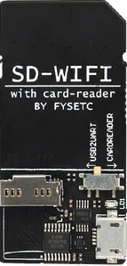
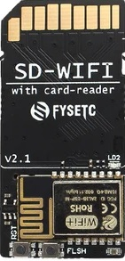
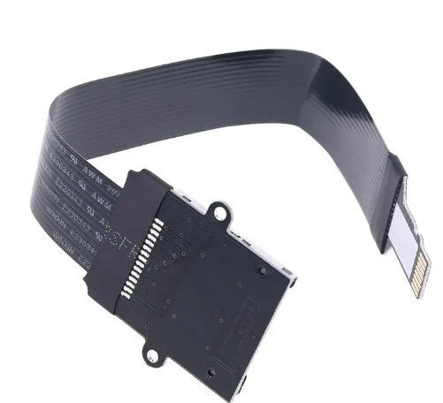

# Sdcard over wifi

## FYSETC-SD-WIFI

Device:





with sdcard to micro sd adapter :


Seems to work, but it needs some tips in order to use it on Twilighte board.

### Setup

Plug a sdcard into FYSETC-SD-WIFI device. Use sdcard adapter and insert it into micro sd card adapter in Twilighte board, and the sdcard side into FYSETC-SD-WIFI board

Install "Termite" rs232 tool


Plug usb port from FYSETC-SD-WIFI into PC USB port

Start termite (it should be connected to the right port)

Set wifi with command M50, M51, M52 :

```bash
M50: Set the wifi ssid , 'M50 ssid-name'
M51: Set the wifi password , 'M51 password'
M52: Start to connect the wifi
M53: Check the connection status
```

### Important tip

This device works but when Orix reads the sdcard, it locks the wifi side. In order to free the sdcard in order to get it again from wifi connection :

First method :

* Wait a bit

At this step, an "I/O error" will be displayed when there is no storage device.

Second method :

* Press reset from sdcard device.

## SD BigTreetech BTT TF Cloud V1.0

Not enough reliability
