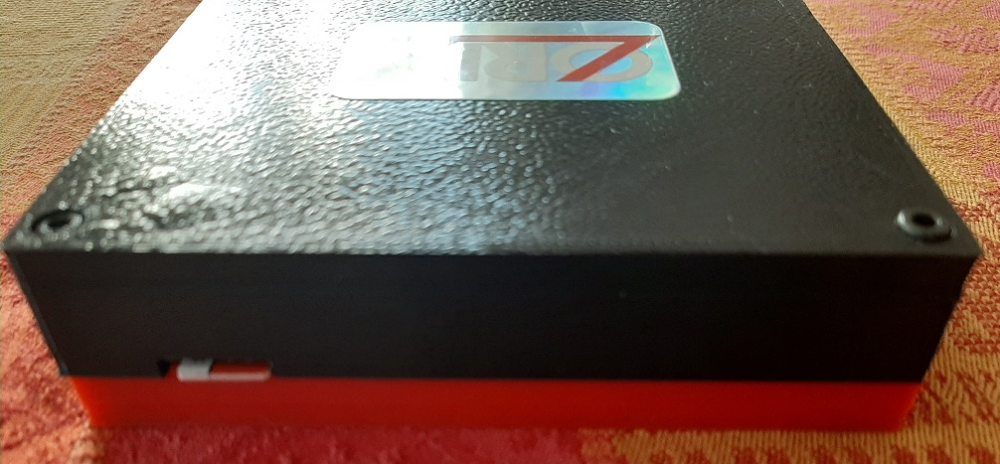
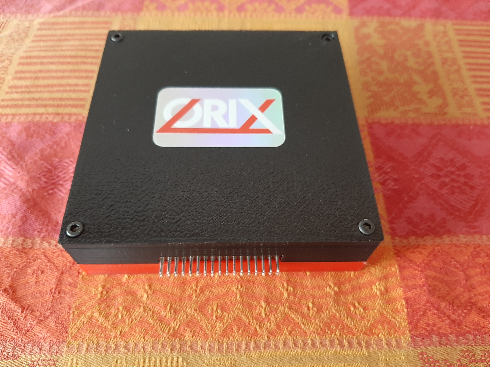
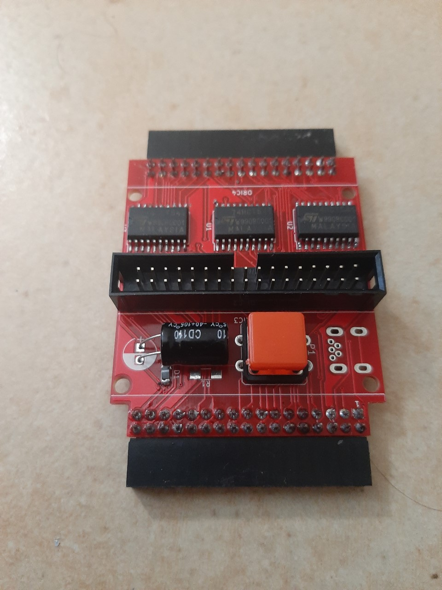
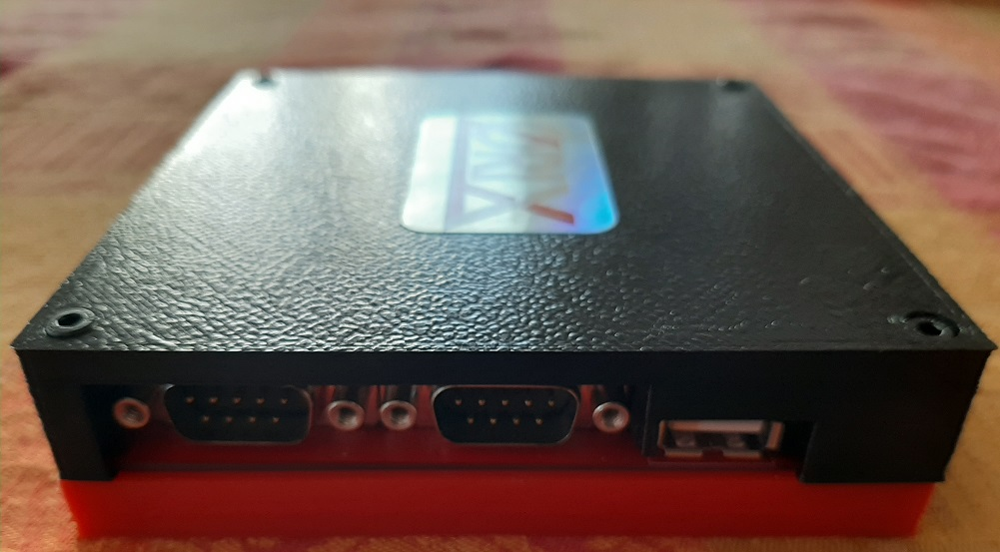
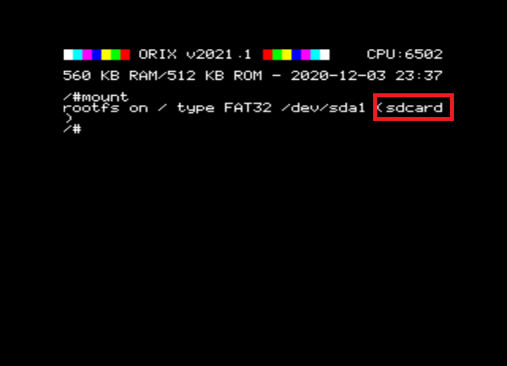
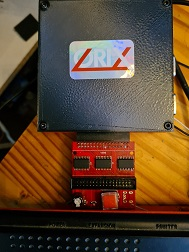
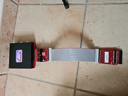

# Quick Start

The original URL of this manual  is here : [https://orix-software.github.io/](https://orix-software.github.io/)

## General information

* Twilighte board is the hardware, Orix is the OS
* The board always boots without any storage device (sdcard or usb). If it does not, it's probably a incompatibility with the Oric : add an amplibus before the board
* In order to work properly, Orix needs storage device connected (usb mass storage or sdcard) with all files from sdcard.tgz : [http://repo.orix.oric.org/dists/official/tgz/6502/sdcard.tgz](http://repo.orix.oric.org/dists/official/tgz/6502/sdcard.tgz)

## Features

On this page : [features](../feature.md), some video are diplayed to show some features

## Ports

{ align=left }
{ width="300" }
{ width="300" }
{ width="300" }

## Hardware limits

The usb controler manage FAT32 only. Sdcard and usb key must be formatted with FAT32 filesystem.  If you want to use pi zero gadget trick, you need to do a mkfs to FAT32 file system.

All tests had been done with *samsung evo* sdcard and sandisk usb key. A lot of sdcard works, and some incompatibility could be find.

Sdcard controler and usb key controler can work with 32GB storage. But it can handle 64 GB sdcard (tested). It can handle larger sdcard/usb key reader, but only 32 and 64 GB devices was used.

## Information about joysticks part

The left port has only 1 button. The right port has 3 buttons. The joystick pinout is atari pinout. You can use standard DB9 joystick. You can also plug « TOM2 » hardware (not provided), it can connect a usb mouse or usb joypad (wireless) to theses ports.  For example, logitech joypad F710 (wireless) works with TOM2.
Please note that TOM2 can only handle 2 buttons. It means that the third button can’t work with TOM2 connected.


## First boot : Initialize the storage

When the card is sent, kernel is built with a default storage. In order to know which device is the default one, you can type « mount ».



You can only use one device at the same time, but you can swap easily theses devices from command line.

If you see « sdcard », then sdcard will be read by default. You can change it, with a command : « twil -u », it will switch to usbdrive. If you want to have usb drive by default, you can program kernel with the tool « orixcfg ». See Orixcfg section.

Now, if you know which device you will use by default, you can install all software on it.

Plug the device on your PC (sdcard or usb key). If you have a pi zero w, you can do this with drag and drop solution from the PC.

Download sdcard.tgz from this : [http://repo.orix.oric.org/dists/official/tgz/6502/](http://repo.orix.oric.org/dists/official/tgz/6502/)

This .tgz  contains all software for orix there is others which are not available in this archive.

Now, use 7zip on a PC (or tar/gzip under linux), and unzip all files from this sdcard.tgz. Put all theses new files in your device root folder.

The content should be like this if sdcard.tgz had been unzipped:


Insert the device (sdcard or usbkey – or pi zero) in the twilighte board and play.

## Upgrade from v2023.2 to v2023.3

* Download : [http://repo.orix.oric.org/dists/official/tgz/6502/sdcard.tgz](http://repo.orix.oric.org/dists/official/tgz/6502/sdcard.tgz)
* untar/gunzip sdcard.tgz (use 7zip under windows) on your device usb or sdcard : It could require some time to copy because there is a lot of small files (tap, hlp etc)

Now start orix on real machine, and type :

```bash
/#cd usr
/usr#cd share
/usr/share#cd carts
/usr/share/carts#cd 2023.3
```

if the default device wanted is usb  :

```bash
/usr/share/carts/2022.1#orixcfg -r -s 4 kernelus.r64
```

For sdcard default device :

```bash
/usr/share/carts/2022.1#orixcfg -r -s 4 kernelsd.r64
```

* press ‘y’, and wait until *Orix reboots*. Don’t switch off the Oric at this step

If the card is below v2023.2 version, it's possible

## Optionnal step for upgrade

Now bank displays all banks from l to 64. It means that you should have some strange bank signature for eeprom. Now an empty set is provided in /usr/share/carts/2021.3 folder. With Orixcfg you can initialize your set with this cart. Don’t use « -s 4 » flag for orixcfg when you want to load emptyset.
First step : type a command

### Commands

Many commands are available

* From /bin folders, there is binary available on current device, ‘ls’ will show you available commands
* From banks : type « help -b5 » you will see available commands

## EEPROM update

For board with 39SF040 eeprom, only use *orixcfg equal or greater than 2023.2*. Check version under Orix with :

```bash
orixcfg -v
```

Beta version is here: [http://repo.orix.oric.org/dists/alpha/tgz/6502/orixcfg.tgz](http://repo.orix.oric.org/dists/alpha/tgz/6502/orixcfg.tgz)

To check which eeprom version is installed (Device Id field):

```bash
orixcfg -i
```

## How the board must be plugged



If there is incompatibility issue use next board usage.

## How the board must be plugged when board does not with the oric (keyboard is lost or prompt does not appears)


